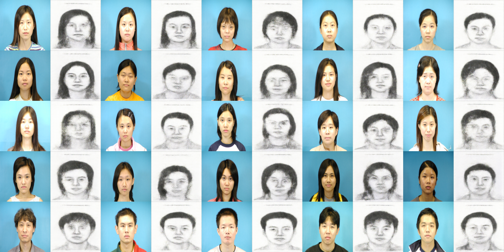
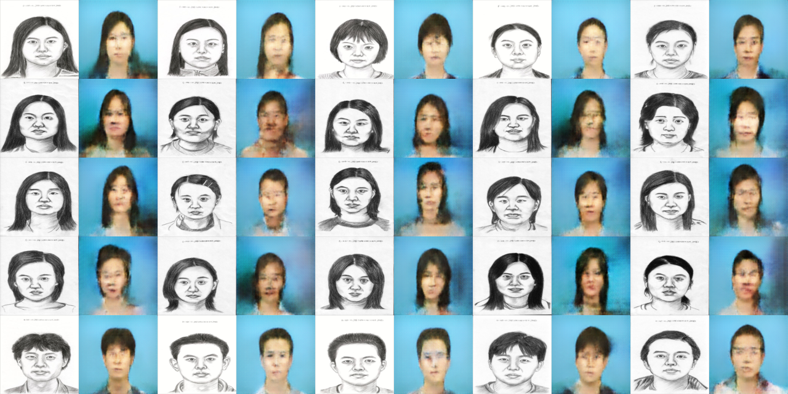

<h2> Image to Sketch Translation </h2>

An application which converts a given <b>Image</b> -> <b>Sketch</b> & <b>Sketch</b> -> <b>Image</b>.

 We have used <b>Cycle-Generative Adversial Network</b>, which contains 2 discriminators and 2 generators.

 Number of iterations = 4000 

 Optimizer = Adam 

 Dataset is taken from various sources and is not self-owned. 

<h2> Results</h2>
<h4>Image to sketch</h4>

<h4> Sketch to Image </h4>

<h2> References</h2>

1. <a href="https://github.com/junyanz/CycleGAN">Cycle-GAN github repository </a>

2. <a href="https://arxiv.org/pdf/1703.10593.pdf">Paper "Unpaired Image-to-Image Translation using Cycle-Consistent Adversial Networks"</a>

